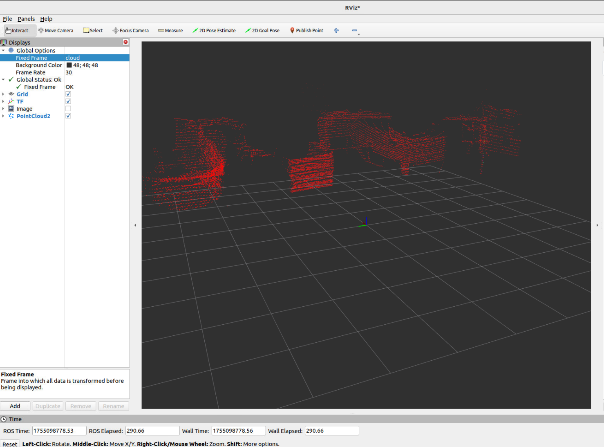
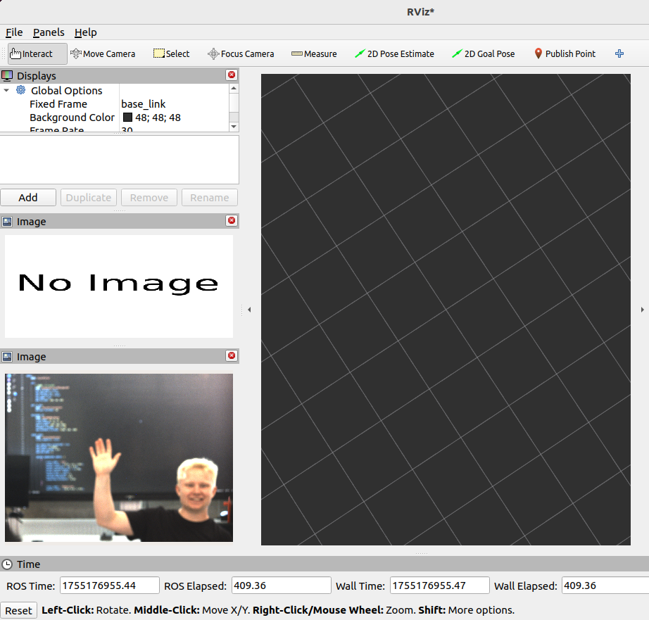
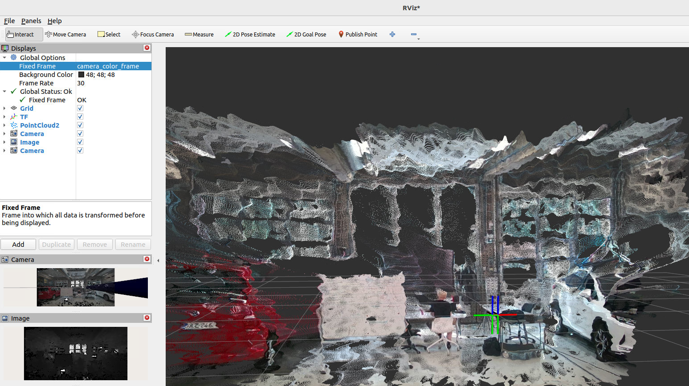
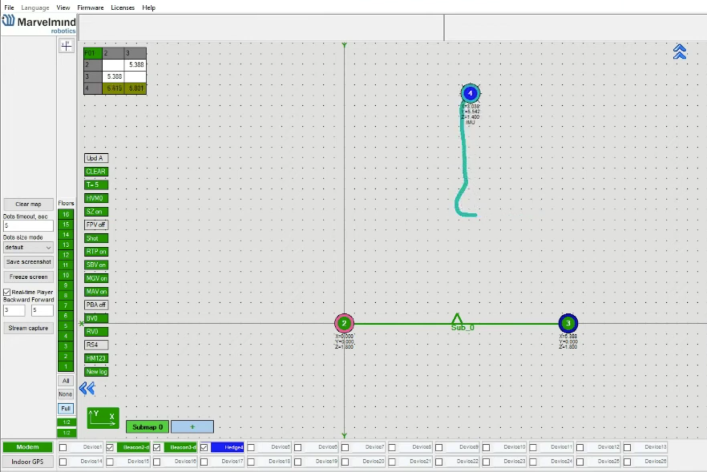

## Setup

This section provides step-by-step instructions for setting up each sensor used in the lab, including installation of drivers, basic usage, relevant ROS 2 packages, and visualisation methods.  
All examples assume you are using **ROS 2 Humble** on **Ubuntu 22.04**, with a working ROS2 workspace `~/ros2_ws` already created and sourced.
---

### LIDAR
#### Driver Installation
```bash 
#bash commands
sudo apt update  
sudo apt install ros-humble-sick-scan-xd  
```

#### Usage
```bash
#Launch file
ros2 launch sick_scan_xd sick_mrs_6xxx.launch.py hostname:=192.168.1.18

#For visualisation:
rviz2 rviz2
```  

##### Topics

- `/cloud`: Publishes the 3D point cloud (`sensor_msgs/msg/PointCloud2`) from the LiDAR at  10 Hz frequency (10 msg/second)
- `/scan`: Publishes 2D laser scan slices (`sensor_msgs/msg/LaserScan`) from the LiDAR.
- `/diagnostics`: Publishes system condition and status information (`diagnostic_msgs/msg/DiagnosticArray`) from drivers and hardware.
- `/imu`: Publishes orientation, angular velocity, and linear acceleration data (`sensor_msgs/msg/Imu`) from the IMU sensor.
- `/sick_mrs_6xxx/encoder`: Publishes rotary encoder readings (e.g., rotation position of the scanner) for 3D scan assembly.
- `/tf`: Publishes coordinate frame transformations (`tf2_msgs/msg/TFMessage`).

#### Package
Launch file:
```python 
#/opt/ros/humble/share/sick_scan_xd/launch/sick_mrs_6xxx.launch.py

import os
import sys
from ament_index_python.packages import get_package_share_directory
from launch import LaunchDescription
from launch_ros.actions import Node
from launch.actions import DeclareLaunchArgument

def generate_launch_description():

    ld = LaunchDescription()
    sick_scan_pkg_prefix = get_package_share_directory('sick_scan_xd')
    launchfile = os.path.basename(__file__)[:-3] # convert "<lidar_name>.launch.py" to "<lidar_name>.launch"
    launch_file_path = os.path.join(sick_scan_pkg_prefix, 'launch/' + launchfile) # 'launch/sick_mrs_6xxx.launch')
    node_arguments=[launch_file_path]
    
    # append optional commandline arguments in name:=value syntax
    for arg in sys.argv:
        if len(arg.split(":=")) == 2:
            node_arguments.append(arg)
    
    ROS_DISTRO = os.environ.get('ROS_DISTRO') # i.e. 'eloquent', 'foxy', etc.
    if ROS_DISTRO[0] <= "e": # ROS versions eloquent and earlier require "node_executable", ROS foxy and later use "executable"
        node = Node(
            package='sick_scan_xd',
            node_executable='sick_generic_caller',
            output='screen',
            arguments=node_arguments
        )
    else: # ROS versions eloquent and earlier require "node_executable", ROS foxy and later use "executable"
        node = Node(
            package='sick_scan_xd',
            executable='sick_generic_caller',
            output='screen',
            arguments=node_arguments
        )
    
    ld.add_action(node)
    return ld


```  
Config file:
```xml 
<!-- /opt/ros/humble/share/sick_scan_xd/launch/sick_mrs_6xxx.launch-->

<?xml version="1.0"?>
<!-- EXPERIMENTAL - brand new driver -->
<!-- Using node option required="true" will close roslaunch after node exits -->
<launch>
    <arg name="hostname" default="192.168.0.1"/>
    <arg name="cloud_topic" default="cloud"/>
    <arg name="laserscan_topic" default="scan"/>
    <arg name="imu_topic" default="imu" />
    <arg name="frame_id" default="cloud"/>
    <arg name="nodename" default="sick_mrs_6xxx"/>
    <arg name="add_transform_xyz_rpy" default="0,0,0,0,0,0"/>
    <arg name="add_transform_check_dynamic_updates" default="false"/> <!-- Note: dynamical updates of parameter add_transform_xyz_rpy can decrease the performance and is therefor deactivated by default -->
    <!-- robot_description and robot_state_publisher will be published here -->
    <arg name="tf_publish_rate" default="10.0" />                     <!-- Rate to publish TF messages in hz, use 0 to deactivate TF messages -->
    <node name="$(arg nodename)" pkg="sick_scan_xd" type="sick_generic_caller" respawn="false" output="screen" required="true">
        <!-- default values: -->
        <!--
          <param name="scanner_type" type="string" value="sick_mrs_6xxx"
          <param name="min_ang" type="double" value="-2.35619449019" />
          <param name="max_ang" type="double" value="2.35619449019" />
          <param name="intensity" type="bool" value="True" />
          <param name="skip" type="int" value="0" />
          <param name="time_offset" type="double" value="-0.001" />
          <param name="publish_datagram" type="bool" value="False" />
          <param name="subscribe_datagram" type="bool" value="false" />
          <param name="device_number" type="int" value="0" />
          <param name="range_min" type="double" value="0.05" />
          <param name="imu_enable" type="bool" value="True" />
          <param name="imu_frame_id" type="string" value="imu_link"/>
        -->
        <param name="filter_echos" type="int" value="2"/>
        <param name="scanner_type" type="string" value="sick_mrs_6xxx"/>
        
        <!-- Optional range filter configuration: If the range of a scan point is less than range_min or greater than range_max, the point can be filtered. -->
        <!-- Depending on parameter range_filter_handling, the following filter can be applied for points with a range not within [range_min, range_max],   -->
        <!-- see enumeration RangeFilterResultHandling in range_filter.h:                                           -->
        <!--   0: RANGE_FILTER_DEACTIVATED,  do not apply range filter (default)                                    -->
        <!--   1: RANGE_FILTER_DROP,         drop point, if range is not within [range_min, range_max]              -->
        <!--   2: RANGE_FILTER_TO_ZERO,      set range to 0, if range is not within [range_min, range_max]          -->
        <!--   3: RANGE_FILTER_TO_RANGE_MAX, set range to range_max, if range is not within [range_min, range_max]  -->
        <!--   4: RANGE_FILTER_TO_FLT_MAX,   set range to FLT_MAX, if range is not within [range_min, range_max]    -->
        <!--   5: RANGE_FILTER_TO_NAN        set range to NAN, if range is not within [range_min, range_max]        -->
        <!-- Note: Range filter applies only to Pointcloud messages, not to LaserScan messages.                     -->
        <!-- Using range_filter_handling 4 or 5 requires handling of FLT_MAX and NAN values in an application.      -->
        <param name="range_min" type="double" value="0.1"/>
        <param name="range_max" type="double" value="250.0"/>
        <param name="range_filter_handling" type="int" value="0"/>
        
        <param name="hostname" type="string" value="$(arg hostname)"/>
        <param name="cloud_topic" type="string" value="$(arg cloud_topic)"/>
        <param name="laserscan_topic" type="string" value="$(arg laserscan_topic)"/>
        <param name="imu_topic" type="string" value="$(arg imu_topic)"/>
        <param name="frame_id" type="str" value="$(arg frame_id)"/>
        <param name="port" type="string" value="2112"/>
        <param name="timelimit" type="int" value="5"/>
        <param name="min_ang" type="double" value="-1.047"/>
        <param name="max_ang" type="double" value="+1.047"/>
        <param name="use_binary_protocol" type="bool" value="True"/>
        <param name="sw_pll_only_publish" type="bool" value="False"/>
        <param name="use_generation_timestamp" type="bool" value="true"/> <!-- Use the lidar generation timestamp (true, default) or send timestamp (false) for the software pll converted message timestamp -->
        <param name="min_intensity" type="double" value="0.0"/> <!-- Set range of LaserScan messages to infinity, if intensity < min_intensity (default: 0) -->
        <param name="scandatacfg_timingflag" type="int" value="-1"/> <!-- Set timing flag LMDscandatacfg (LMS-1XX, LMS-1XXX, LMS-4XXX, LMS-5XX, MRS-1XXX, MRS-6XXX, NAV-2XX, TIM-240, TIM-4XX, TIM-5XX, TIM-7XX, TIM-7XXS): -1: use default (off for TiM-240, otherwise on), 0: do not send time information, 1: send time information -->

        <!-- Apply an additional transform to the cartesian pointcloud, default: "0,0,0,0,0,0" (i.e. no transform) -->
        <!-- Note: add_transform_xyz_rpy is specified by 6D pose x, y, z, roll, pitch, yaw in [m] resp. [rad] -->
        <!-- It transforms a 3D point in cloud coordinates to 3D point in user defined world coordinates: --> 
        <!-- add_transform_xyz_rpy := T[world,cloud] with parent "world" and child "cloud", i.e. P_world = T[world,cloud] * P_cloud -->
        <!-- The additional transform applies to cartesian lidar pointclouds and visualization marker (fields) -->
        <!-- It is NOT applied to polar pointclouds, radarscans, ldmrs objects or other messages -->
        <param name="add_transform_xyz_rpy" type="string" value="$(arg add_transform_xyz_rpy)" /> 
        <param name="add_transform_check_dynamic_updates" type="bool" value="$(arg add_transform_check_dynamic_updates)" />

        <param name="start_services" type="bool" value="True" />                  <!-- Start ros service for cola commands, default: true -->
        <param name="message_monitoring_enabled" type="bool" value="True" />      <!-- Enable message monitoring with reconnect+reinit in case of timeouts, default: true -->
        <param name="read_timeout_millisec_default" type="int" value="5000"/>     <!-- 5 sec read timeout in operational mode (measurement mode), default: 5000 milliseconds -->
        <param name="read_timeout_millisec_startup" type="int" value="120000"/>   <!-- 120 sec read timeout during startup (sensor may be starting up, which can take up to 120 sec.), default: 120000 milliseconds -->
        <param name="read_timeout_millisec_kill_node" type="int" value="150000"/> <!-- 150 sec pointcloud timeout, ros node will be killed if no point cloud published within the last 150 sec., default: 150000 milliseconds -->
        <!-- Note: read_timeout_millisec_kill_node less or equal 0 deactivates pointcloud monitoring (not recommended) -->
        <param name="user_level" type="int" value="3" />                          <!-- Default user level for authorization (3: client, 4: service) -->
        <param name="user_level_password" type="string" value="F4724744" />       <!-- Default user level password (for "client" (level 3): F4724744, for "service" (level 4): 81BE23AA) -->

        <!-- Configuration of ROS quality of service: -->
        <!-- On ROS-1, parameter "ros_qos" sets the queue_size of ros publisher -->
        <!-- On ROS-2, parameter "ros_qos" sets the QoS of ros publisher to one of the following predefined values: -->
        <!-- 0: rclcpp::SystemDefaultsQoS(), 1: rclcpp::ParameterEventsQoS(), 2: rclcpp::ServicesQoS(), 3: rclcpp::ParametersQoS(), 4: rclcpp::SensorDataQoS() -->
        <!-- See e.g. https://docs.ros2.org/dashing/api/rclcpp/classrclcpp_1_1QoS.html#ad7e932d8e2f636c80eff674546ec3963 for further details about ROS2 QoS -->
        <!-- Default value is -1, i.e. queue_size=10 on ROS-1 resp. qos=rclcpp::SystemDefaultsQoS() on ROS-2 is used.-->
        <param name="ros_qos" type="int" value="-1"/>  <!-- Default QoS=-1, i.e. do not overwrite, use queue_size=10 on ROS-1 resp. qos=rclcpp::SystemDefaultsQoS() on ROS-2 -->

        <!-- 
        On ROS-1 and ROS-2, sick_scan_xd publishes TF messsages to map a given base frame (i.e. base coordinates system) to the lidar frame (i.e. lidar coordinates system) and vice versa.
        The default base frame id is "map" (which is the default frame in rviz). 
        The default 6D pose is (x,y,z,roll,pitch,yaw) = (0,0,0,0,0,0) defined by position (x,y,z) in meter and (roll,pitch,yaw) in radians.
        This 6D pose (x,y,z,roll,pitch,yaw) is the transform T[base,lidar] with parent "base" and child "lidar".
        For lidars mounted on a carrier, the lidar pose T[base,lidar] and base frame can be configured in this launchfile using the following parameter.
        The lidar frame id given by parameter "frame_id" resp. "publish_frame_id".
        Note that the transform is specified using (x,y,z,roll,pitch,yaw). In contrast, the ROS static_transform_publisher uses commandline arguments in order (x,y,z,yaw,pitch,roll).
        -->
        <param name="tf_base_frame_id" type="string" value="map" />              <!-- Frame id of base coordinates system, e.g. "map" (default frame in rviz) -->
        <param name="tf_base_lidar_xyz_rpy" type="string" value="0,0,0,0,0,0" /> <!-- T[base,lidar], 6D pose (x,y,z,roll,pitch,yaw) in meter resp. radians with parent "map" and child "cloud" -->
        <param name="tf_publish_rate" type="double" value="$(arg tf_publish_rate)" />                <!-- Rate to publish TF messages in hz, use 0 to deactivate TF messages -->

        <!-- 
        Optional mode to convert lidar ticks to ros- resp. system-timestamps:
        tick_to_timestamp_mode = 0 (default): convert lidar ticks in microseconds to system timestamp by software-pll
        tick_to_timestamp_mode = 1 (optional tick-mode): convert lidar ticks in microseconds to timestamp by 1.0e-6*(curtick-firstTick)+firstSystemTimestamp
        tick_to_timestamp_mode = 2 (optional tick-mode): convert lidar ticks in microseconds directly into a lidar timestamp by sec = tick/1000000, nsec = 1000*(tick%1000000)
        Note: Using tick_to_timestamp_mode = 2, the timestamps in ROS message headers will be in lidar time, not in system time. Lidar and system time can be very different.
        Using tick_to_timestamp_mode = 2 might cause unexpected results or error messages. We recommend using tick_to_timestamp_mode = 2 for special test cases only.
        -->
        <param name="tick_to_timestamp_mode" type="int" value="0"/>

    </node>
</launch>

```  
#### Visualisation
3D Point Cloud Visualisation in RViz: The LiDAR scans from the `/cloud` topic are displayed in RViz using a fixed frame **cloud**



### IMU
#### Driver Installation
```bash 
#bash commands
cd ~/ros2_ws/src
git clone https://github.com/flynneva/bno055.git
cd ~/ros2_ws
colcon build –symlink-install
source ~/ros2_ws/install/setup.bash
```

#### Usage
```bash
#Launch file
ros2 launch bno055 bno055.launch.py
```  
After running the launch file, the sensor will publish data to many topics:

##### Topics

- `/bno055/imu`: Publishes orientation, angular velocity, and linear acceleration data (`sensor_msgs/msg/Imu`) from the sensor.
- `/bno055/imu_raw`: Publishes raw orientation, angular velocity, and linear acceleration data (`sensor_msgs/msg/Imu`).
- `/bno055/temp`: Publishes the sensor's ambient temperature (`sensor_msgs/msg/Temperature`).
- `/bno055/mag`: Publishes magnetometer readings (`sensor_msgs/msg/MagneticField`).
- `/bno055/grav`: Publishes the gravity vector (`geometry_msgs/msg/Vector3`) in m/s² measured by the sensor.
- `/bno055/calib_status`: Publishes sensor calibration status as a JSON string (`std_msgs/msg/String`), e.g., `{"sys": 3, "gyro": 3, "accel": 0, "mag": 3}`.

To read the measurments:
```bash
ros2 topic echo </topic>
```  


#### Package
Launch file:

```python
#~/ros2_ws/src/bno055/launch/bno055.launch.py
import os
from ament_index_python.packages import get_package_share_directory
from launch import LaunchDescription
from launch_ros.actions import Node
def generate_launch_description():
    ld = LaunchDescription()
    config = os.path.join(
        get_package_share_directory('bno055'),
        'config',
        'bno055_params.yaml'
        )
        
    node=Node(
        package = 'bno055',
        executable = 'bno055',
        parameters = [config]
    )
    ld.add_action(node)
    return ld
```

Config file:
```yaml
#~/ros2_ws/src/bno055/bno055/params/bno055_params.yaml

# Example parameters for a UART connection to the BNO055 motion sensor.
bno055:
  ros__parameters:
    ros_topic_prefix: "bno055/"
    connection_type: "uart"
    uart_port: "/dev/ttyUSB0"
    uart_baudrate: 115200
    uart_timeout: 0.1
    data_query_frequency: 1 #100
    calib_status_frequency: 0.1
    frame_id: "bno055"
    operation_mode: 0x0C
    placement_axis_remap: "P2"
    acc_factor: 100.0
    mag_factor: 16000000.0
    gyr_factor: 900.0
    grav_factor: 100.0
    set_offsets: false # set to true to use offsets below
    offset_acc: [0xFFEC, 0x00A5, 0xFFE8]
    offset_mag: [0xFFB4, 0xFE9E, 0x027D]
    offset_gyr: [0x0002, 0xFFFF, 0xFFFF]
    ## Sensor standard deviation [x,y,z]
    ## Used to calculate covariance matrices
    ## defaults are used if parameters below are not provided
    # variance_acc: [0.0, 0.0, 0.0] # [m/s^2]
    # variance_angular_vel: [0.0, 0.0, 0.0] # [rad/s]
    # variance_orientation: [0.0, 0.0, 0.0] # [rad]
    # variance_mag: [0.0, 0.0, 0.0] # [Tesla]

```
You can change the sensor parameters here, and as shown, the current publishing frequency is 1 Hz (1 msg/second).


#### Visualisation
```bash
$ ros2 topic echo /bno055/imu
header:
  stamp:
    sec: 1755168728
    nanosec: 718217821
  frame_id: bno055
orientation:
  x: -0.02343808688623238
  y: -0.003295980968376428
  z: 0.0
  w: 0.9997198570562503
orientation_covariance:
- 0.0159
- 0.0
- 0.0
- 0.0
- 0.0159
- 0.0
- 0.0
- 0.0
- 0.0159
angular_velocity:
  x: 0.0
  y: 0.0022222222222222222
  z: 0.0
angular_velocity_covariance:
- 0.04
- 0.0
- 0.0
- 0.0
- 0.04
- 0.0
- 0.0
- 0.0
- 0.04
linear_acceleration:
  x: 0.0
  y: 0.03
  z: -0.34
linear_acceleration_covariance:
- 0.017
- 0.0
- 0.0
- 0.0
- 0.017
- 0.0
- 0.0
- 0.0
- 0.017
---
```
### Camera
#### Driver Installation
```bash 
#bash commands
sudo apt install ros-humble-spinnaker-camera-driver
source /opt/ros/humble/setup.bash
cd ~/ros2_ws/src # create a workspace if its not there, then access src
git clone --branch humble-devel https://github.com/ros-drivers/flir_camera_driver
cd ~/ros2_ws
rosdep install --from-paths src –ignore-src
colcon build –symlink-install 
source ~/ros2_ws/install/setup.bash 
```

#### Usage
```bash
#Launch file
ros2 launch spinnaker_camera_driver driver_node.launch.py camera_type:=chameleon serial:="'20073275'"

#For visualisation:
rviz2 rviz2
#or
rqt_image_view 
```  

##### Topics

- `/flir_camera/image_raw`: Publishes the raw image data (`sensor_msgs/msg/Image`) captured by the camera at 20 Hz (20msg/second).
- `/flir_camera/camera_info`: Publishes intrinsic and extrinsic calibration parameters (`sensor_msgs/msg/CameraInfo`) of the camera.
- `/flir_camera/meta`: Publishes metadata (`flir_camera_msgs/msg/ImageMetaData`) containing additional information about the captured images.

#### Package
Launch file:  

```python
#~/ros2_ws/src/flir_camera_driver/spinnaker_camera_driver/launch/driver_node.launch.py

#You can modify the camera parameters direcly from the launch file on the chameleon section

from launch import LaunchDescription
from launch.actions import DeclareLaunchArgument as LaunchArg
from launch.actions import OpaqueFunction
from launch.substitutions import LaunchConfiguration as LaunchConfig
from launch.substitutions import PathJoinSubstitution
from launch_ros.actions import Node
from launch_ros.substitutions import FindPackageShare

example_parameters = {
    'blackfly_s': {
        'debug': False,
        'compute_brightness': False,
        'adjust_timestamp': True,
        'dump_node_map': False,
        # set parameters defined in blackfly_s.yaml
        'gain_auto': 'Continuous',
        # 'pixel_format': 'BayerRG8',
        'exposure_auto': 'Continuous',
        # to use a user set, do this:
        # 'user_set_selector': 'UserSet0',
        # 'user_set_load': 'Yes',
        # These are useful for GigE cameras
        # 'device_link_throughput_limit': 380000000,
        # 'gev_scps_packet_size': 9000,
        # PTP for GigE cameras
        # 'gev_ieee_1588': True,
        # 'gev_ieee_1588_mode': 'SlaveOnly', # 'SlaveOnly',  #'Auto',
        # 'use_ieee_1588' : True,
        # ---- to reduce the sensor width and shift the crop
        # 'image_width': 1408,
        # 'image_height': 1080,
        # 'offset_x': 16,
        # 'offset_y': 0,
        # 'binning_x': 1,
        # 'binning_y': 1,
        # 'connect_while_subscribed': True,
        # 'reverse_x': True,
        # 'reverse_y': True,
        'frame_rate_auto': 'Off',
        'frame_rate': 40.0,
        'frame_rate_enable': True,
        'buffer_queue_size': 10,
        'trigger_mode': 'Off',
        'chunk_mode_active': True,
        'chunk_selector_frame_id': 'FrameID',
        'chunk_enable_frame_id': True,
        'chunk_selector_exposure_time': 'ExposureTime',
        'chunk_enable_exposure_time': True,
        'chunk_selector_gain': 'Gain',
        'chunk_enable_gain': True,
        'chunk_selector_timestamp': 'Timestamp',
        'chunk_enable_timestamp': True,
    },
    'blackfly': {
        'debug': False,
        'dump_node_map': False,
        'gain_auto': 'Continuous',
        'pixel_format': 'BayerRG8',
        'exposure_auto': 'Continuous',
        'frame_rate_auto': 'Off',
        'frame_rate': 40.0,
        'frame_rate_enable': True,
        'buffer_queue_size': 10,
        'trigger_mode': 'Off',
        # 'stream_buffer_handling_mode': 'NewestFirst',
        # 'multicast_monitor_mode': False
    },
    'chameleon': {
        'debug': False,
        'compute_brightness': False,
        'dump_node_map': False,
        # set parameters defined in chameleon.yaml
        'gain_auto': 'Continuous',
        'exposure_auto': 'Continuous',
        'offset_x': 0,
        'offset_y': 0,
        'image_width': 2048,
        'image_height': 1536,
        'pixel_format': 'RGB8',  # 'BayerRG8, 'RGB8' or 'Mono8'
        'frame_rate_continous': True,
        'frame_rate': 100.0,
        'trigger_mode': 'Off',
        'chunk_mode_active': True,
        'chunk_selector_frame_id': 'FrameID',
        'chunk_enable_frame_id': True,
        'chunk_selector_exposure_time': 'ExposureTime',
        'chunk_enable_exposure_time': True,
        'chunk_selector_gain': 'Gain',
        'chunk_enable_gain': True,
        'chunk_selector_timestamp': 'Timestamp',
        'chunk_enable_timestamp': True,
    },
    'grasshopper': {
        'debug': False,
        'compute_brightness': False,
        'dump_node_map': False,
        # set parameters defined in grasshopper.yaml
        'gain_auto': 'Continuous',
        'exposure_auto': 'Continuous',
        'frame_rate_auto': 'Off',
        'frame_rate': 100.0,
        'trigger_mode': 'Off',
        'chunk_mode_active': True,
        'chunk_selector_frame_id': 'FrameID',
        'chunk_enable_frame_id': True,
        'chunk_selector_exposure_time': 'ExposureTime',
        'chunk_enable_exposure_time': True,
        'chunk_selector_gain': 'Gain',
        'chunk_enable_gain': True,
        'chunk_selector_timestamp': 'Timestamp',
        'chunk_enable_timestamp': True,
    },
    'flir_ax5': {
        'debug': False,
        'compute_brightness': False,
        'adjust_timestamp': False,
        'dump_node_map': False,
        # --- Set parameters defined in flir_ax5.yaml
        'pixel_format': 'Mono8',
        'gev_scps_packet_size': 576,
        'image_width': 640,
        'image_height': 512,
        'offset_x': 0,
        'offset_y': 0,
        'sensor_gain_mode': 'HighGainMode',  # "HighGainMode" "LowGainMode"
        'nuc_mode': 'Automatic',  # "Automatic" "External" "Manual"
        'sensor_dde_mode': 'Automatic',  # "Automatic" "Manual"
        'sensor_video_standard': 'NTSC30HZ',  # "NTSC30HZ" "PAL25Hz" "NTSC60HZ" "PAL50HZ"
        # valid values: "PlateauHistogram" "OnceBright" "AutoBright" "Manual" "Linear"
        'image_adjust_method': 'PlateauHistogram',
        'video_orientation': 'Normal',  # "Normal" "Invert" "Revert" "InvertRevert"
    },
}


def launch_setup(context, *args, **kwargs):
    """Launch camera driver node."""
    parameter_file = LaunchConfig('parameter_file').perform(context)
    camera_type = LaunchConfig('camera_type').perform(context)
    if not parameter_file:
        parameter_file = PathJoinSubstitution(
            [FindPackageShare('spinnaker_camera_driver'), 'config', camera_type + '.yaml']
        )
    if camera_type not in example_parameters:
        raise Exception('no example parameters available for type ' + camera_type)

    node = Node(
        package='spinnaker_camera_driver',
        executable='camera_driver_node',
        output='screen',
        name=[LaunchConfig('camera_name')],
        parameters=[
            example_parameters[camera_type],
            {
                'ffmpeg_image_transport.encoding': 'hevc_nvenc',
                'parameter_file': parameter_file,
                'serial_number': [LaunchConfig('serial')],
            },
        ],
        remappings=[
            ('~/control', '/exposure_control/control'),
        ],
    )

    return [node]


def generate_launch_description():
    """Create composable node by calling opaque function."""
    return LaunchDescription(
        [
            LaunchArg(
                'camera_name',
                default_value=['flir_camera'],
                description='camera name (ros node name)',
            ),
            LaunchArg(
                'camera_type',
                default_value='blackfly_s',
                description='type of camera (blackfly_s, chameleon...)',
            ),
            LaunchArg(
                'serial',
                default_value="'20435008'",
                description='FLIR serial number of camera (in quotes!!)',
            ),
            LaunchArg(
                'parameter_file',
                default_value='',
                description='path to ros parameter definition file (override camera type)',
            ),
            OpaqueFunction(function=launch_setup),
        ]
    )
```
Config file:
```yaml
#~/ros2_ws/src/flir_camera_driver/spinnaker_camera_driver/config/chameleon.yaml

# config file for Chameleon cameras (tested for USB3)
#
# This file maps the ros parameters to the corresponding Spinnaker "nodes" in the camera.
# For more details on how to modify this file, see the README on camera configuration files.

parameters:
  #
  # --------- image format control
  #
  - name: pixel_format
    type: enum
    # Check available values with SpinView. Not all are supported by ROS!
    # Some formats are e.g. "Mono8", "BayerRG8", "BGR8", "BayerRG16"
    # default is "BayerRG8"
    node: ImageFormatControl/PixelFormat
  - name: image_width
    type: int
    node: ImageFormatControl/Width
  - name: image_height
    type: int
    node: ImageFormatControl/Height
  - name: offset_x
    type: int
    node: ImageFormatControl/OffsetX
  - name: offset_y
    type: int
    node: ImageFormatControl/OffsetY
  - name: reverse_x
    type: bool
    node: ImageFormatControl/ReverseX
  - name: reverse_y
    type: bool
    node: ImageFormatControl/ReverseY
  - name: video_mode
    type: enum
    # allowed video modes: Mode0, Mode4, Mode5, Mode7
    node: ImageFormatControl/VideoMode
  #
  # -------- analog control
  #
  - name: gain_auto
    type: enum
    # enum values: Continuous and Off
    node: AnalogControl/GainAuto
  - name: gain
    type: float
    node: AnalogControl/Gain
  #
  # -------- digital IO control
  #
  - name: line0_selector # NOT TESTED: probably yellow wire: opto-isolated input
    type: enum
    node: DigitalIOControl/LineSelector
  - name: line1_selector # NOT TESTED: probably orange wire: opto-isolated output
    type: enum
    node: DigitalIOControl/LineSelector
  - name: line2_selector # NOT TESTED: probably purple wire: non-isolated input/output
    type: enum
    node: DigitalIOControl/LineSelector
  - name: line2_linemode # NOT TESTED
    type: bool
    node: DigitalIOControl/LineMode
  - name: line3_selector # NOT TESTED probably green wire: non-isolated input/output
    type: enum
    node: DigitalIOControl/LineSelector
  - name: line3_linemode # NOT TESTED
    type: enum
    # valid values: "Input", "Output"
    node: DigitalIOControl/LineMode
  #
  # -------- acquisition control
  #
  - name: exposure_auto
    type: enum
    # valid values: "Continuous" and "Off"
    node: AcquisitionControl/ExposureAuto
  - name: exposure_time
    type: float
    node: AcquisitionControl/ExposureTime
  - name: trigger_mode
    type: enum
    # valid values are "On" and "Off"
    node: AcquisitionControl/TriggerMode
  - name: acquisition_mode
    type: enum
    # valid values are "Continuous", "SingleFrame", "MultiFrame"
    node: AcquisitionControl/AcquisitionMode
  - name: frame_rate_continuous
    type: bool
    node: AcquisitionControl/AcquisitionFrameRateContinuous
  - name: frame_rate
    type: float
    node: AcquisitionControl/AcquisitionFrameRate
  - name: trigger_selector
    type: enum
    # valid values are e.g. "FrameStart", "ExposureActive"
    node: AcquisitionControl/TriggerSelector
  - name: trigger_source
    type: enum
    # valid values are "Software", "Line<0,2,3>"
    node: AcquisitionControl/TriggerSource
  - name: trigger_delay  # NOT TESTED
    type: float
    node: AcquisitionControl/TriggerDelay
  - name: trigger_overlap  # NOT TESTED
    type: enum
    # valid values: "Off" and "ReadOut"
    node: AcquisitionControl/TriggerOverlap
  #
  # --------- chunk control
  #
  - name: chunk_mode_active
    type: bool
    node: ChunkDataControl/ChunkModeActive
  - name: chunk_selector_frame_counter
    type: enum
    # valid values: "FrameCounter"
    node: ChunkDataControl/ChunkSelector
  - name: chunk_enable_frame_counter
    type: bool
    node: ChunkDataControl/ChunkEnable
  - name: chunk_selector_exposure_time
    type: enum
    # valid values: "ExposureTime"
    node: ChunkDataControl/ChunkSelector
  - name: chunk_enable_exposure_time
    type: bool
    node: ChunkDataControl/ChunkEnable
  - name: chunk_selector_gain
    type: enum
    # valid values: "Gain"
    node: ChunkDataControl/ChunkSelector
  - name: chunk_enable_gain
    type: bool
    node: ChunkDataControl/ChunkEnable
  - name: chunk_selector_timestamp
    type: enum
    # valid values: "Timestamp"
    node: ChunkDataControl/ChunkSelector
  - name: chunk_enable_timestamp
    type: bool
    node: ChunkDataControl/ChunkEnable

```
#### Visualisation
FLIR Camera Visualisation in RViz: Displayed image stream published on `/flir_camera/image_raw`



### Depth Camera
#### Driver Installation
```bash 
#bash commands
sudo apt install ros-humble-librealsense2*
sudo apt install ros-humble-realsense2-*
```

#### Usage
```bash  
#Launch file
ros2 launch realsense2_camera rs_launch.py depth_module.depth_profile:=1280x720x30 pointcloud.enable:=true

#For visualisation:
rviz2 rviz2
#or
rqt_image_view 
```  

##### Topics
- `/camera/camera/depth/color/points`: Publishes 3D point cloud (`sensor_msgs/msg/PointCloud2`)
- `/camera/camera/color/camera_info`: Publishes intrinsic and extrinsic calibration parameters (`sensor_msgs/msg/CameraInfo`) for the color camera.
- `/camera/camera/color/image_raw`: Publishes raw image frames (`sensor_msgs/msg/Image`) from the color camera.
- `/camera/camera/color/metadata`: Publishes metadata (`realsense2_camera_msgs/msg/Metadata` or similar custom type) for each color frame, including camera settings and capture time.
- `/camera/camera/depth/camera_info`: Publishes intrinsic and extrinsic calibration parameters (`sensor_msgs/msg/CameraInfo`) for the depth camera.
- `/camera/camera/depth/image_rect_raw`: Publishes the rectified depth image (`sensor_msgs/msg/Image`) from the depth camera.
- `/camera/camera/depth/metadata`: Publishes metadata (`realsense2_camera_msgs/msg/Metadata`) for each depth frame, including camera settings and capture time.
- `/camera/camera/extrinsics/depth_to_color`: Publishes extrinsic transformation parameters (`realsense2_camera_msgs/msg/Extrinsics`) describing the spatial relationship between the depth and color camera frames.

#### Package
Launch file:  

```python
#/opt/ros/humble/share/realsense2_camera/launch/rs_launch.py

"""Launch realsense2_camera node."""
import os
import yaml
from launch import LaunchDescription
import launch_ros.actions
from launch.actions import DeclareLaunchArgument, OpaqueFunction
from launch.substitutions import LaunchConfiguration


configurable_parameters = [{'name': 'camera_name',                  'default': 'camera', 'description': 'camera unique name'},
                           {'name': 'camera_namespace',             'default': 'camera', 'description': 'namespace for camera'},
                           {'name': 'serial_no',                    'default': "''", 'description': 'choose device by serial number'},
                           {'name': 'usb_port_id',                  'default': "''", 'description': 'choose device by usb port id'},
                           {'name': 'device_type',                  'default': "''", 'description': 'choose device by type'},
                           {'name': 'config_file',                  'default': "''", 'description': 'yaml config file'},
                           {'name': 'json_file_path',               'default': "''", 'description': 'allows advanced configuration'},
                           {'name': 'initial_reset',                'default': 'false', 'description': "''"},
                           {'name': 'accelerate_gpu_with_glsl',     'default': "false", 'description': 'enable GPU acceleration with GLSL'},
                           {'name': 'rosbag_filename',              'default': "''", 'description': 'A realsense bagfile to run from as a device'},
                           {'name': 'log_level',                    'default': 'info', 'description': 'debug log level [DEBUG|INFO|WARN|ERROR|FATAL]'},
                           {'name': 'output',                       'default': 'screen', 'description': 'pipe node output [screen|log]'},
                           {'name': 'enable_color',                 'default': 'true', 'description': 'enable color stream'},
                           {'name': 'rgb_camera.color_profile',     'default': '0,0,0', 'description': 'color stream profile'},
                           {'name': 'rgb_camera.color_format',      'default': 'RGB8', 'description': 'color stream format'},
                           {'name': 'rgb_camera.enable_auto_exposure', 'default': 'true', 'description': 'enable/disable auto exposure for color image'},
                           {'name': 'enable_depth',                 'default': 'true', 'description': 'enable depth stream'},
                           {'name': 'enable_infra',                 'default': 'false', 'description': 'enable infra0 stream'},
                           {'name': 'enable_infra1',                'default': 'false', 'description': 'enable infra1 stream'},
                           {'name': 'enable_infra2',                'default': 'false', 'description': 'enable infra2 stream'},
                           {'name': 'depth_module.depth_profile',   'default': '0,0,0', 'description': 'depth stream profile'},
                           {'name': 'depth_module.depth_format',    'default': 'Z16', 'description': 'depth stream format'},
                           {'name': 'depth_module.infra_profile',   'default': '0,0,0', 'description': 'infra streams (0/1/2) profile'},
                           {'name': 'depth_module.infra_format',    'default': 'RGB8', 'description': 'infra0 stream format'},
                           {'name': 'depth_module.infra1_format',   'default': 'Y8', 'description': 'infra1 stream format'},
                           {'name': 'depth_module.infra2_format',   'default': 'Y8', 'description': 'infra2 stream format'},
                           {'name': 'depth_module.exposure',        'default': '8500', 'description': 'Depth module manual exposure value'},
                           {'name': 'depth_module.gain',            'default': '16', 'description': 'Depth module manual gain value'},
                           {'name': 'depth_module.hdr_enabled',     'default': 'false', 'description': 'Depth module hdr enablement flag. Used for hdr_merge filter'},
                           {'name': 'depth_module.enable_auto_exposure', 'default': 'true', 'description': 'enable/disable auto exposure for depth image'},
                           {'name': 'depth_module.exposure.1',      'default': '7500', 'description': 'Depth module first exposure value. Used for hdr_merge filter'},
                           {'name': 'depth_module.gain.1',          'default': '16', 'description': 'Depth module first gain value. Used for hdr_merge filter'},
                           {'name': 'depth_module.exposure.2',      'default': '1', 'description': 'Depth module second exposure value. Used for hdr_merge filter'},
                           {'name': 'depth_module.gain.2',          'default': '16', 'description': 'Depth module second gain value. Used for hdr_merge filter'},
                           {'name': 'enable_sync',                  'default': 'false', 'description': "'enable sync mode'"},
                           {'name': 'enable_rgbd',                  'default': 'false', 'description': "'enable rgbd topic'"},
                           {'name': 'enable_gyro',                  'default': 'false', 'description': "'enable gyro stream'"},
                           {'name': 'enable_accel',                 'default': 'false', 'description': "'enable accel stream'"},
                           {'name': 'gyro_fps',                     'default': '0', 'description': "''"},
                           {'name': 'accel_fps',                    'default': '0', 'description': "''"},
                           {'name': 'unite_imu_method',             'default': "0", 'description': '[0-None, 1-copy, 2-linear_interpolation]'},
                           {'name': 'clip_distance',                'default': '-2.', 'description': "''"},
                           {'name': 'angular_velocity_cov',         'default': '0.01', 'description': "''"},
                           {'name': 'linear_accel_cov',             'default': '0.01', 'description': "''"},
                           {'name': 'diagnostics_period',           'default': '0.0', 'description': 'Rate of publishing diagnostics. 0=Disabled'},
                           {'name': 'publish_tf',                   'default': 'true', 'description': '[bool] enable/disable publishing static & dynamic TF'},
                           {'name': 'tf_publish_rate',              'default': '0.0', 'description': '[double] rate in Hz for publishing dynamic TF'},
                           {'name': 'pointcloud.enable',            'default': 'false', 'description': ''},
                           {'name': 'pointcloud.stream_filter',     'default': '2', 'description': 'texture stream for pointcloud'},
                           {'name': 'pointcloud.stream_index_filter','default': '0', 'description': 'texture stream index for pointcloud'},
                           {'name': 'pointcloud.ordered_pc',        'default': 'false', 'description': ''},
                           {'name': 'pointcloud.allow_no_texture_points', 'default': 'false', 'description': "''"},
                           {'name': 'align_depth.enable',           'default': 'false', 'description': 'enable align depth filter'},
                           {'name': 'colorizer.enable',             'default': 'false', 'description': 'enable colorizer filter'},
                           {'name': 'decimation_filter.enable',     'default': 'false', 'description': 'enable_decimation_filter'},
                           {'name': 'spatial_filter.enable',        'default': 'false', 'description': 'enable_spatial_filter'},
                           {'name': 'temporal_filter.enable',       'default': 'false', 'description': 'enable_temporal_filter'},
                           {'name': 'disparity_filter.enable',      'default': 'false', 'description': 'enable_disparity_filter'},
                           {'name': 'hole_filling_filter.enable',   'default': 'false', 'description': 'enable_hole_filling_filter'},
                           {'name': 'hdr_merge.enable',             'default': 'false', 'description': 'hdr_merge filter enablement flag'},
                           {'name': 'wait_for_device_timeout',      'default': '-1.', 'description': 'Timeout for waiting for device to connect (Seconds)'},
                           {'name': 'reconnect_timeout',            'default': '6.', 'description': 'Timeout(seconds) between consequtive reconnection attempts'},
                          ]

def declare_configurable_parameters(parameters):
    return [DeclareLaunchArgument(param['name'], default_value=param['default'], description=param['description']) for param in parameters]

def set_configurable_parameters(parameters):
    return dict([(param['name'], LaunchConfiguration(param['name'])) for param in parameters])

def yaml_to_dict(path_to_yaml):
    with open(path_to_yaml, "r") as f:
        return yaml.load(f, Loader=yaml.SafeLoader)

def launch_setup(context, params, param_name_suffix=''):
    _config_file = LaunchConfiguration('config_file' + param_name_suffix).perform(context)
    params_from_file = {} if _config_file == "''" else yaml_to_dict(_config_file)

    _output = LaunchConfiguration('output' + param_name_suffix)
    if(os.getenv('ROS_DISTRO') == 'foxy'):
        # Foxy doesn't support output as substitution object (LaunchConfiguration object)
        # but supports it as string, so we fetch the string from this substitution object
        # see related PR that was merged for humble, iron, rolling: https://github.com/ros2/launch/pull/577
        _output = context.perform_substitution(_output)

    return [
        launch_ros.actions.Node(
            package='realsense2_camera',
            namespace=LaunchConfiguration('camera_namespace' + param_name_suffix),
            name=LaunchConfiguration('camera_name' + param_name_suffix),
            executable='realsense2_camera_node',
            parameters=[params, params_from_file],
            output=_output,
            arguments=['--ros-args', '--log-level', LaunchConfiguration('log_level' + param_name_suffix)],
            emulate_tty=True,
            )
    ]

def generate_launch_description():
    return LaunchDescription(declare_configurable_parameters(configurable_parameters) + [
        OpaqueFunction(function=launch_setup, kwargs = {'params' : set_configurable_parameters(configurable_parameters)})
    ])

```
Config file:
```yaml
#/opt/ros/humble/share/realsense2_camera/examples/launch_params_from_file/config/config.yaml
enable_color: true # Enables color stream
rgb_camera.profile: 1280x720x15 # Sets resolution and FPS for RGB camera
enable_depth: true # Enables depth stream
align_depth.enable: true # Aligns depth image to RGB frame
enable_sync: true # Synchronizes streams
publish_tf: true # Publishes TF transforms for camera frames
tf_publish_rate: 1.0 # Sets TF publish frequency in Hz
```
You can modify the parameters, either in the Config file or in the terminal:

```bash
#Example:
ros2 launch realsense2_camera rs_launch.py depth_module.depth_profile:=1280x720x30 pointcloud.enable:=true
```
We are setting : pointcloud.enable:=true , depth_module-depth_pofile:=1280x720x30


Note that there is some parameters that cannot be changed directly from the terminal, for more details about parameters: [ Intel realsense parameters ](https://github.com/IntelRealSense/realsense-ros?tab=readme-ov-file#parameters)

#### Visualisation

Intel RealSense Depth Camera Visualization in RViz: Displays the colored 3D point cloud from `/camera/camera/depth/color/points` with the fixed frame set to `camera_color_frame`.



### RTLS
#### Driver Installation
```bash 
#bash commands
cd ros2_ws/src
source ~/ros2_ws/install/setup.bash
git clone https://github.com/MarvelmindRobotics/marvelmind_ros2_msgs_upstream.git # for API and services such as:  requesting Mobile and static beacons adresses, charge infomations and more, or even applying set up changes: set beacon with adderss 5 static 
git clone https://github.com/MarvelmindRobotics/marvelmind_ros2_upstream.git # contaning launch file and main nodes
cd ~/ros2_ws
colcon build –symlink-install
source ~/ros2_ws/install/setup.bash
```

#### Usage
```bash
#Launch file
ros2 launch marvelmind_ros2 marvelmind_ros2.launch.py 		

# Make sure the modem is connected and the USB is plugged in.
# and all the needed beacons and the hedgehog are on	
# Notations ---> Static : beacons, #Mobile : hedgehog 
```  
After running the launch file, the sensor will publish data to many topics:


##### Topics

- `/hedgehog_pos`: Publishes the position (`marvelmind_ros2_msgs/msg/HedgePosition`) of the mobile beacon in the RTLS coordinate frame.
- `/hedgehog_pos_addressed`: Publishes the position and the address (`marvelmind_ros2_msgs/msg/HedgePositionAddressed`) of the mobile beacon.
- `/beacons_pos_addressed`: Publishes the positions of stationary beacons and their addresses (`marvelmind_ros2_msgs/msg/BeaconPositionAddressed`).
- `/hedgehog_imu_fusion`: Publishes fused IMU data (`marvelmind_ros2_msgs/msg/HedgeImuFusion`) 
- `/hedgehog_imu_raw`: Publishes raw IMU data (`marvelmind_ros2_msgs/msg/HedgeImuRaw`) from the mobile beacon without fusion or filtering.
- `/hedgehog_pos_ang`: Publishes position and orientation angles (`marvelmind_ros2_msgs/msg/HedgePositionAngle`) of the mobile beacon.
- `/hedgehog_quality`: Publishes signal quality and tracking status (`marvelmind_ros2_msgs/msg/HedgeQuality`) for the mobile beacon.
- `/hedgehog_telemetry`: Publishes telemetry data (`marvelmind_ros2_msgs/msg/HedgeTelemetry`) including battery status, temperature, and other system diagnostics from the mobile beacon.

To read the measurments:
```bash
ros2 topic echo </topic>
# make sure the API node is not running to be able to listen to the topics
```  
To get informations related the beacons: Addresses of static and mobile beacons, charge information or even applying set up changes such as waking up a beacon and more in ROS
```bash
# On another terminal, run
ros2 run marvelmind_ros2 marvelmind_api_ros2
``` 
Here is the list of command you request from the API :
```C
#define MM_API_ID_API_VERSION 1
#define MM_API_ID_GET_LAST_ERROR 2
#define MM_API_ID_OPEN_PORT 3
#define MM_API_ID_OPEN_PORT_BY_NAME 4
#define MM_API_ID_OPEN_PORT_UDP 5
#define MM_API_ID_CLOSE_PORT 6
#define MM_API_ID_GET_VERSION_AND_ID 7
#define MM_API_ID_GET_DEVICES_LIST 8
#define MM_API_ID_WAKE_DEVICE 9
#define MM_API_ID_SLEEP_DEVICE 10
#define MM_API_ID_GET_BEACON_TELEMETRY 11
#define MM_API_ID_GET_LAST_LOCATIONS2 13
#define MM_API_ID_GET_LAST_DISTANCES 14
#define MM_API_ID_GET_UPDATE_RATE 15
#define MM_API_ID_SET_UPDATE_RATE 16
#define MM_API_ID_ADD_SUBMAP 17
#define MM_API_ID_DELETE_SUBMAP 18
#define MM_API_ID_FREEZE_SUBMAP 19
#define MM_API_ID_UNFREEZE_SUBMAP 20
#define MM_API_ID_ERASE_MAP 30
#define MM_API_ID_SET_DEFAULT 31
#define MM_API_ID_FREEZE_MAP 32
#define MM_API_ID_UNFREEZE_MAP 33
#define MM_API_ID_BEACONS_TO_AXES 34
#define MM_API_ID_READ_FLASH_DUMP 35
#define MM_API_ID_WRITE_FLASH_DUMP 36
#define MM_API_ID_RESET_DEVICE 37
#define MM_API_ID_GET_AIR_TEMPERATURE 38
#define MM_API_ID_SET_AIR_TEMPERATURE 39
#define MM_API_ID_SET_BEACON_LOCATION 40
#define MM_API_ID_SET_BEACONS_DISTANCE 41
#define MM_API_ID_GET_HEDGE_HEIGHT 42
#define MM_API_ID_SET_HEDGE_HEIGHT 43
#define MM_API_ID_GET_BEACON_HEIGHT 44
#define MM_API_ID_SET_BEACON_HEIGHT 45
#define MM_API_ID_GET_RTP_SETTINGS 46
#define MM_API_ID_SET_RTP_SETTINGS 47
#define MM_API_ID_GET_GEOREFERENCING 48
#define MM_API_ID_SET_GEOREFERENCING 49
#define MM_API_ID_GET_UPDATE_POSITIONS_MODE 50
#define MM_API_ID_SET_UPDATE_POSITIONS_MODE 51
#define MM_API_ID_SEND_UPDATE_POSITIONS_COMMAND 52
#define MM_API_ID_SET_ALARM_STATE 53
#define MM_API_ID_GET_USER_PAYLOAD 54
#define MM_API_ID_SET_USER_PAYLOAD 55
#define MM_API_ID_DEVICE_IS_MODEM 56
#define MM_API_ID_DEVICE_IS_BEACON 57
#define MM_API_ID_DEVICE_IS_HEDGEHOG 58
#define MM_API_ID_DEVICE_IS_ROBOT 59
``` 
Example:
```bash
#On another terminal (while keeping the main launch file and API node running):
ros2 service call /marvelmind_api marvelmind_ros2_msgs/srv/MarvelmindAPI "{command_id: 8, request: []}" 
```
The command_id 8: **MM_API_ID_GET_DEVICES_LIST**, will output the connected beacons and displays some informations about them :
```bash
response:
marvelmind_ros2_msgs.srv.MarvelmindAPI_Response(success=True, error_code=0, response=[3, 5, 0, 0, 8, 10, 0, 42, 0, 1, 3, 0, 0, 8, 10, 0, 42, 0, 1, 6, 0, 0, 8, 10, 0, 43, 0, 1])

# the first bit shows the number of devices connected, in this case: 3 devices are connected
# for each beacon you can get informations on a 9 bit format:
# [ address, isDuplicatedAddress, isSleeping,fwVerMajor, fwVerMinor, fwVerMinor2, fwVerDeviceType, fwOptions, flags ]
# For device type 42: Static, 43: mobile
# as we can see from the example, beacon of address 6 is the hedgehog whereas beacons 5 and 3 are static beacons
```
Another example:
```bash
# Waking up Beacon of address 6:
ros2 service call /marvelmind_api marvelmind_ros2_msgs/srv/MarvelmindAPI "{command_id: 9, request: [6]}”
```
However, it’s recommended to configure the system using the Windows or Linux dashboard provided by Marvelmind, it’s more stable and includes a GUI for map building and visualization.
Concerning the initial configurations, it was mandatory to you use the dashboard and download the firmware on each beacon.



For more informations, Please check: [Operating manual](https://marvelmind.com/pics/marvelmind_navigation_system_manual.pdf), [Linux Dashboard](https://marvelmind.com/pics/dashboard_linux_manual.pdf), [Usage Tutorial](https://www.youtube.com/watch?v=Uj2_BGS1AjI)


#### Package

Launch file:
```python
# ~/ros2_ws/src/marvelmind_ros2_upstream/launch/marvelmind_ros2.launch.py
import os

from ament_index_python import get_package_share_directory
from launch import LaunchDescription
from launch.actions import DeclareLaunchArgument
from launch.actions import IncludeLaunchDescription
from launch.launch_description_sources import PythonLaunchDescriptionSource
from launch.substitutions import LaunchConfiguration
from launch_ros.actions import Node


def get_share_file(package_name, file_name):
    return os.path.join(get_package_share_directory(package_name), file_name)


def generate_launch_description():

    # Define config file location
    marvelmind_ros2_config_file = get_share_file(
        package_name='marvelmind_ros2', file_name='config/marvelmind_ros2_config.yaml'
    )

    # tell ros we are using a config file
    marvelmind_ros2_config = DeclareLaunchArgument(
        'marvelmind_ros2_config_file',
        default_value=marvelmind_ros2_config_file,
        description='Path to config file for marvelmind_ros2_config parameters'
    )

    # define node to launch and parameters to use
    marvelmind_ros2_node = Node(
        package='marvelmind_ros2',
        executable='marvelmind_ros2',
        output='screen',
        arguments=['--ros-args', '--log-level', 'rclcpp:=WARN', '--log-level', 'hedgehog_logger:=INFO'],
        parameters=[LaunchConfiguration('marvelmind_ros2_config_file')],
    )

    return LaunchDescription([
        marvelmind_ros2_config,
        marvelmind_ros2_node,
    ])

```
Config file:
```yaml
# ~/ros2_ws/src/marvelmind_ros2_upstream/config/marvelmind_ros2_config.yaml
marvelmind_ros2:
  ros__parameters:
    hedgehog_pos_topic: "/hedgehog_pos"
    hedgehog_pos_addressed_topic: "/hedgehog_pos_addressed"
    hedgehog_pos_angle_topic: "/hedgehog_pos_ang"
    hedgehog_imu_raw_topic: "/hedgehog_imu_raw"
    hedgehog_imu_fusion_topic: "/hedgehog_imu_fusion"
    hedgehog_telemetry_topic: "/hedgehog_telemetry" 
    hedgehog_quality_topic: "/hedgehog_quality"
    beacon_raw_distance_topic: "/beacon_raw_distance"
    beacon_pos_addressed_topic: "/beacons_pos_addressed"
    marvelmind_waypoint_topic: "/marvelmind_waypoint"
    data_input_semaphore_name: "/data_input_semaphore"
    marvelmind_publish_rate_in_hz: 50 # Publishing rate
    marvelmind_tty_baudrate: 9600 # likely does not every need to change
    marvelmind_tty_filename: "/dev/ttyACM0"

marvelmind_api_ros2:
  ros__parameters:
    marvelmind_publish_rate_in_hz: 50
    marvelmind_tty_baudrate: 9600 # likely does not every need to change
    marvelmind_tty_filename: "/dev/ttyACM0"
```

You can change also, the sensor parameters here, and as shown, the current publishing frequency is 50 Hz (50 msg/second).

#### Visualisation
```bash
# Make sure that the needed beacons are ON and charged!

# In this case we are using beacons 3 and 5 as static and 6 as the hedgehog
# so we can compute its position relative to them.

# After running the main launch file, on another terminal:

ros2 topic echo /hedgehog_pos_addressed

address: 6
timestamp_ms: 113244765
x_m: 0.444
y_m: -0.031
z_m: 0.96
flags: 2
---
address: 6
timestamp_ms: 113244906
x_m: 0.456
y_m: -0.032
z_m: 0.96
flags: 2
---
address: 6
timestamp_ms: 113245047
x_m: 0.456
y_m: -0.032
z_m: 0.96
flags: 2
---
address: 6
timestamp_ms: 113245189
x_m: 0.453
y_m: -0.031
z_m: 0.96
flags: 2
---
address: 6
timestamp_ms: 113245330
x_m: 0.443
y_m: -0.031
z_m: 0.96
flags: 2
---
address: 6
timestamp_ms: 113245471
x_m: 0.449
y_m: -0.031
z_m: 0.96
flags: 2
---
address: 6
timestamp_ms: 113245613
x_m: 0.447
y_m: -0.031
z_m: 0.96
flags: 2
---
address: 6
timestamp_ms: 113245754
x_m: 0.442
y_m: -0.031
z_m: 0.96
flags: 2
---
address: 6
timestamp_ms: 113245895
x_m: 0.44
y_m: -0.031
z_m: 0.96
flags: 2
---
```
